# UniClub DDD Class Diagram

## Full DDD Structure For All Modules

This diagram is the DDD version of an MVC class diagram. Instead of `Model`, `View`, and `Controller`, the project is grouped by DDD layers:

- `Presentation`: controllers and views
- `Application`: services, validators, and DTOs
- `Domain`: entities, value objects, repository interfaces, and domain exceptions
- `Infrastructure`: concrete repositories, database access, mail, uploads, and persistence details

```mermaid
classDiagram
    direction TB

    namespace Presentation {
        class AuthPresentation {
            AuthController
            PasswordResetController
            Auth Views
        }

        class UserPresentation {
            UserController
            ProfileController
            Profile Views
        }

        class ClubPresentation {
            AdminClubController
            UserClubController
            Club Views
        }

        class MembershipPresentation {
            MembershipController
            AdminMembershipController
            Membership Views
        }

        class EventPresentation {
            EventController
            AdminEventController
            Event Views
        }

        class EventAttendancePresentation {
            EventAttendanceController
            AdminEventAttendanceController
            Attendance Views
        }

        class EventFeedbackPresentation {
            EventFeedbackController
            AdminEventFeedbackController
            Feedback Views
        }

        class EventCertificatePresentation {
            EventCertificateController
            AdminEventCertificateController
            Certificate Views
        }

        class PaymentPresentation {
            StudentPaymentController
            AdminPaymentController
            Payment Views
        }

        class PaymentAccountPresentation {
            AdminPaymentAccountController
            Payment Account Views
        }

        class AnnouncementPresentation {
            AnnouncementController
            AdminAnnouncementController
            Announcement Views
        }

        class ContactPresentation {
            ContactController
            AdminContactController
            Contact Views
        }

        class NotificationPresentation {
            NotificationController
            Notification Views
        }

        class DashboardPresentation {
            DashboardController
            Dashboard Views
        }

        class UserManagementPresentation {
            UserManagementController
            User Management Views
        }

        class RBACPresentation {
            RolePermissionController
            RBAC Views
        }

        class SettingsPresentation {
            GeneralSettingController
            SecuritySettingController
            Settings Views
        }

        class AuditPresentation {
            AuditController
            Audit Views
        }

        class HomePresentation {
            HomeController
            Home Views
        }
    }

    namespace Application {
        class AuthApplication {
            AuthService
            PasswordResetService
            PasswordPolicyService
            LoginProtectionService
            RegisterValidator
            LoginValidator
            ForgotPasswordValidator
            VerifyOtpValidator
            ResetPasswordValidator
            LoginDTO
            RegisterDTO
        }

        class UserApplication {
            UserService
            UpdateProfileValidator
            ChangePasswordValidator
            UserDTO
            UpdateProfileDTO
        }

        class ClubApplication {
            ClubService
            ClubValidator
            ClubDTO
        }

        class MembershipApplication {
            MembershipService
        }

        class EventApplication {
            EventService
            EventValidator
        }

        class EventAttendanceApplication {
            EventAttendanceService
        }

        class EventFeedbackApplication {
            EventFeedbackService
        }

        class EventCertificateApplication {
            EventCertificateService
            CertificatePdfService
            CertificateGenerator
        }

        class PaymentApplication {
            PaymentService
            PaymentValidator
        }

        class PaymentAccountApplication {
            PaymentAccountService
            PaymentAccountValidator
        }

        class AnnouncementApplication {
            AnnouncementService
        }

        class ContactApplication {
            ContactService
        }

        class NotificationApplication {
            NotificationService
        }

        class DashboardApplication {
            DashboardService
            DashboardDTO
        }

        class UserManagementApplication {
            UserManagementService
            UserManagementValidator
            ManagedUserDTO
            UserFilterDTO
        }

        class RBACApplication {
            PermissionService
            RolePermissionService
        }

        class SettingsApplication {
            GeneralSettingService
            SecuritySettingService
        }

        class AuditApplication {
            AuditService
        }

        class HomeApplication {
            HomeService
        }

        class MasterApplication {
            MasterService
        }
    }

    namespace Domain {
        class AuthDomain {
            PasswordResetOtp
            Email
            Password
            PasswordPolicy
            PhoneNumber
            StudentId
            UserName
            Auth UserRepositoryInterface
            PasswordResetRepositoryInterface
            LoginAttemptRepositoryInterface
            Auth Exceptions
        }

        class UserDomain {
            User
            UserRepositoryInterface
        }

        class ClubDomain {
            Club
            ClubRepositoryInterface
            ClubException
            ClubNotFoundException
            DuplicateClubException
        }

        class MembershipDomain {
            Membership
            MembershipRepositoryInterface
        }

        class EventDomain {
            Event
            EventRepositoryInterface
            EventNotFoundException
            EventRegistrationException
        }

        class EventAttendanceDomain {
            EventAttendance
            EventAttendanceRepositoryInterface
        }

        class EventFeedbackDomain {
            EventFeedback
            EventFeedbackRepositoryInterface
            FeedbackNotFoundException
        }

        class EventCertificateDomain {
            EventCertificate
            EventCertificateRepositoryInterface
        }

        class PaymentDomain {
            Payment
            PaymentRepositoryInterface
        }

        class PaymentAccountDomain {
            PaymentAccount
            PaymentAccountRepositoryInterface
        }

        class AnnouncementDomain {
            Announcement
            AnnouncementRepositoryInterface
        }

        class ContactDomain {
            ContactMessage
            ContactRepositoryInterface
        }

        class NotificationDomain {
            Notification
            NotificationRepositoryInterface
        }

        class DashboardDomain {
            DashboardRepositoryInterface
        }

        class UserManagementDomain {
            ManagedUser
            UserManagementRepositoryInterface
        }

        class RBACDomain {
            Role
            Permission
            RoleRepositoryInterface
            PermissionRepositoryInterface
            RolePermissionRepositoryInterface
        }

        class SettingsDomain {
            GeneralSetting
            GeneralSettingRepositoryInterface
            SecuritySettingRepositoryInterface
        }

        class AuditDomain {
            AuditRepositoryInterface
        }

        class HomeDomain {
            HomeRepositoryInterface
        }

        class MasterDomain {
            ClubCategory
            MasterRepositoryInterface
        }
    }

    namespace Infrastructure {
        class AuthInfrastructure {
            PasswordResetRepository
            LoginAttemptRepository
        }

        class UserInfrastructure {
            UserRepository
        }

        class ClubInfrastructure {
            ClubRepository
        }

        class MembershipInfrastructure {
            MembershipRepository
        }

        class EventInfrastructure {
            EventRepository
        }

        class EventAttendanceInfrastructure {
            EventAttendanceRepository
        }

        class EventFeedbackInfrastructure {
            EventFeedbackRepository
        }

        class EventCertificateInfrastructure {
            EventCertificateRepository
        }

        class PaymentInfrastructure {
            PaymentRepository
        }

        class PaymentAccountInfrastructure {
            PaymentAccountRepository
        }

        class AnnouncementInfrastructure {
            AnnouncementRepository
        }

        class ContactInfrastructure {
            ContactRepository
        }

        class NotificationInfrastructure {
            NotificationRepository
        }

        class DashboardInfrastructure {
            DashboardRepository
        }

        class UserManagementInfrastructure {
            UserManagementRepository
        }

        class RBACInfrastructure {
            RoleRepository
            PermissionRepository
            RolePermissionRepository
            PermissionLoader
        }

        class SettingsInfrastructure {
            GeneralSettingRepository
            SecuritySettingRepository
        }

        class AuditInfrastructure {
            AuditRepository
        }

        class HomeInfrastructure {
            HomeRepository
        }

        class MasterInfrastructure {
            MasterRepository
        }

        class SharedInfrastructure {
            Database
            BaseRepository
            Mailer
            EmailService
            ImageUploadService
            AuditLogger
        }
    }

    AuthPresentation --> AuthApplication
    UserPresentation --> UserApplication
    ClubPresentation --> ClubApplication
    MembershipPresentation --> MembershipApplication
    EventPresentation --> EventApplication
    EventAttendancePresentation --> EventAttendanceApplication
    EventFeedbackPresentation --> EventFeedbackApplication
    EventCertificatePresentation --> EventCertificateApplication
    PaymentPresentation --> PaymentApplication
    PaymentAccountPresentation --> PaymentAccountApplication
    AnnouncementPresentation --> AnnouncementApplication
    ContactPresentation --> ContactApplication
    NotificationPresentation --> NotificationApplication
    DashboardPresentation --> DashboardApplication
    UserManagementPresentation --> UserManagementApplication
    RBACPresentation --> RBACApplication
    SettingsPresentation --> SettingsApplication
    AuditPresentation --> AuditApplication
    HomePresentation --> HomeApplication

    AuthApplication --> AuthDomain
    UserApplication --> UserDomain
    ClubApplication --> ClubDomain
    MembershipApplication --> MembershipDomain
    MembershipApplication --> ClubDomain
    EventApplication --> EventDomain
    EventApplication --> ClubDomain
    EventAttendanceApplication --> EventAttendanceDomain
    EventAttendanceApplication --> EventDomain
    EventFeedbackApplication --> EventFeedbackDomain
    EventFeedbackApplication --> EventDomain
    EventCertificateApplication --> EventCertificateDomain
    EventCertificateApplication --> EventDomain
    EventCertificateApplication --> EventAttendanceDomain
    PaymentApplication --> PaymentDomain
    PaymentApplication --> PaymentAccountDomain
    AnnouncementApplication --> AnnouncementDomain
    AnnouncementApplication --> NotificationDomain
    ContactApplication --> ContactDomain
    NotificationApplication --> NotificationDomain
    DashboardApplication --> DashboardDomain
    UserManagementApplication --> UserManagementDomain
    RBACApplication --> RBACDomain
    SettingsApplication --> SettingsDomain
    AuditApplication --> AuditDomain
    HomeApplication --> HomeDomain
    MasterApplication --> MasterDomain

    AuthInfrastructure ..|> AuthDomain
    UserInfrastructure ..|> UserDomain
    ClubInfrastructure ..|> ClubDomain
    MembershipInfrastructure ..|> MembershipDomain
    EventInfrastructure ..|> EventDomain
    EventAttendanceInfrastructure ..|> EventAttendanceDomain
    EventFeedbackInfrastructure ..|> EventFeedbackDomain
    EventCertificateInfrastructure ..|> EventCertificateDomain
    PaymentInfrastructure ..|> PaymentDomain
    PaymentAccountInfrastructure ..|> PaymentAccountDomain
    AnnouncementInfrastructure ..|> AnnouncementDomain
    ContactInfrastructure ..|> ContactDomain
    NotificationInfrastructure ..|> NotificationDomain
    DashboardInfrastructure ..|> DashboardDomain
    UserManagementInfrastructure ..|> UserManagementDomain
    RBACInfrastructure ..|> RBACDomain
    SettingsInfrastructure ..|> SettingsDomain
    AuditInfrastructure ..|> AuditDomain
    HomeInfrastructure ..|> HomeDomain
    MasterInfrastructure ..|> MasterDomain

    AuthInfrastructure --> SharedInfrastructure
    UserInfrastructure --> SharedInfrastructure
    ClubInfrastructure --> SharedInfrastructure
    MembershipInfrastructure --> SharedInfrastructure
    EventInfrastructure --> SharedInfrastructure
    PaymentInfrastructure --> SharedInfrastructure
```

## Compact DDD Class Diagram Like MVC Sample

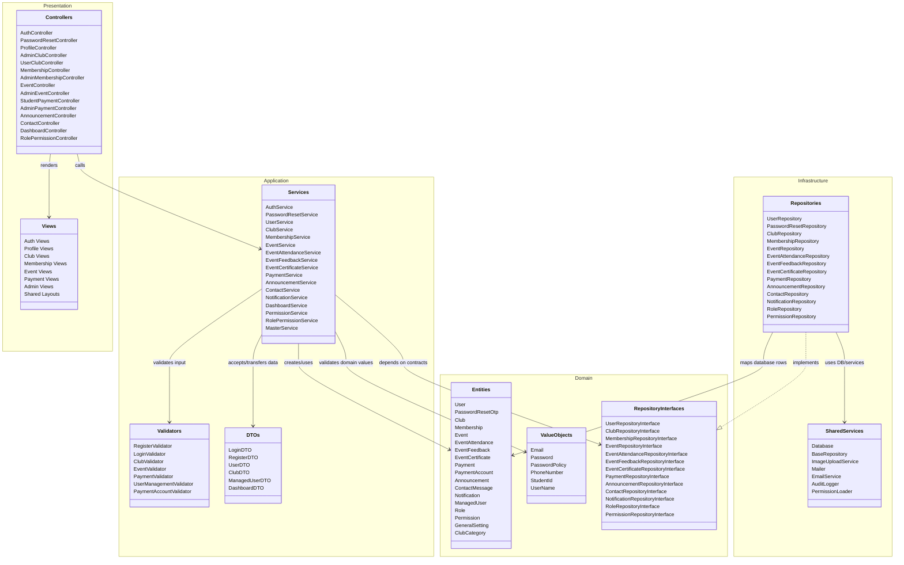

## Club, Membership, Event, Attendance, Feedback, Certificate Combined DDD Diagram

```mermaid
classDiagram
    direction TB

    namespace Presentation {
        class AdminClubController {
            -ClubService clubService
            -MasterService masterService
            +index()
            +show(id)
            +create()
            +store()
            +edit(id)
            +update(id)
            +delete(id)
        }

        class UserClubController {
            -ClubService clubService
            -MembershipService membershipService
            +index()
            +show(id)
            +join(id)
        }

        class MembershipController {
            -MembershipService membershipService
            +join(clubId)
            +myClubs()
            +leave(id)
        }

        class AdminMembershipController {
            -MembershipService membershipService
            +index()
            +members(clubId)
            +editRole(id)
            +updateRole()
            +approve(id)
            +reject(id)
            +remove(id)
        }

        class EventController {
            -EventService eventService
            -ClubService clubService
            -EventAttendanceService attendanceService
            -EventCertificateService certificateService
            +index()
            +show(id)
            +register(id)
            +cancelRegistration(id)
        }

        class AdminEventController {
            -EventService eventService
            -ClubService clubService
            -EventAttendanceService attendanceService
            +index()
            +create()
            +store()
            +edit(id)
            +update(id)
            +delete(id)
            +registrations(id)
            +approveRegistration(id)
            +rejectRegistration(id)
        }

        class EventAttendanceController {
            -EventAttendanceService attendanceService
            +history()
        }

        class AdminEventAttendanceController {
            -EventAttendanceService attendanceService
            -EventService eventService
            +index(eventId)
            +store(eventId)
            +update(eventId)
        }

        class EventFeedbackController {
            -EventFeedbackService feedbackService
            +create(eventId)
            +store(eventId)
        }

        class AdminEventFeedbackController {
            -EventFeedbackService feedbackService
            -EventService eventService
            +index()
            +eventFeedback(eventId)
            +delete(id)
        }

        class EventCertificateController {
            -EventCertificateService certificateService
            +index()
            +download(id)
        }

        class AdminEventCertificateController {
            -EventCertificateService certificateService
            -EventService eventService
            +index(eventId)
            +generate(eventId)
            +generateAll(eventId)
            +download(id)
        }
    }

    namespace Application {
        class ClubService {
            -ClubRepositoryInterface clubRepository
            -ClubValidator clubValidator
            -ImageUploadService imageUploadService
            -AuditLogger auditLogger
            +create(data, files, userId)
            +update(id, data, files)
            +delete(id)
            +getClub(id)
            +getClubs(filters, page)
            +getStudentClubs(filters, page)
            +getMembers(clubId)
            +getLeadership(clubId)
            +getUpcomingEvents(clubId)
        }

        class MembershipService {
            -MembershipRepositoryInterface membershipRepository
            +join(clubId, userId)
            +leave(id)
            +approve(id)
            +reject(id)
            +updateRole(id, roleId)
            +getMyClubs(userId)
            +getClubMembers(clubId)
        }

        class EventService {
            -EventRepositoryInterface eventRepository
            -ImageUploadService imageUploadService
            -NotificationService notificationService
            -AuditLogger auditLogger
            +create(data, files)
            +update(id, data, files)
            +delete(id)
            +getEvent(id)
            +getEvents(filters, page)
            +register(eventId, userId)
            +cancelRegistration(eventId, userId)
            +approveRegistration(id)
            +rejectRegistration(id)
        }

        class EventAttendanceService {
            -EventAttendanceRepositoryInterface attendanceRepository
            -EventService eventService
            +getEventAttendance(eventId)
            +store(eventId, data)
            +update(eventId, data)
            +history(userId)
        }

        class EventFeedbackService {
            -EventFeedbackRepositoryInterface feedbackRepository
            -EventRepositoryInterface eventRepository
            +create(eventId, userId, data)
            +getByEvent(eventId)
            +getAll()
            +delete(id)
        }

        class EventCertificateService {
            -EventCertificateRepositoryInterface certificateRepository
            -EventService eventService
            -EventAttendanceService attendanceService
            -UserService userService
            +getCertificates(userId)
            +generate(eventId, userId)
            +generateAll(eventId)
            +download(id)
        }

        class ClubValidator {
            +validateCreate(data)
            +validateUpdate(data)
        }

        class EventValidator {
            +validateCreate(data)
            +validateUpdate(data)
        }

        class CertificatePdfService {
            +generate(certificateData)
        }

        class CertificateGenerator {
            +generateCertificateNumber()
        }
    }

    namespace Domain {
        class Club {
            -id int
            -categoryId int
            -name string
            -shortName string
            -description string
            -memberLimit int
            -membershipFee float
            -memberCount int
            -status string
            +getId()
            +getName()
            +getMembershipFee()
            +isActive()
        }

        class Membership {
            -id int
            -clubId int
            -userId int
            -roleId int
            -status string
            -joinedAt string
            +getId()
            +getClubId()
            +getUserId()
            +getStatus()
        }

        class Event {
            -id int
            -clubId int
            -title string
            -description string
            -eventDate string
            -location string
            -capacity int
            -status string
            +getId()
            +getClubId()
            +getTitle()
            +getStatus()
        }

        class EventAttendance {
            -id int
            -eventId int
            -userId int
            -status string
            -checkedInAt string
            +getId()
            +getEventId()
            +getUserId()
            +getStatus()
        }

        class EventFeedback {
            -id int
            -eventId int
            -userId int
            -rating int
            -comment string
            +getId()
            +getEventId()
            +getUserId()
            +getRating()
        }

        class EventCertificate {
            -id int
            -eventId int
            -userId int
            -certificateNumber string
            -filePath string
            -issuedAt string
            +getId()
            +getEventId()
            +getUserId()
            +getCertificateNumber()
        }

        class ClubRepositoryInterface {
            <<interface>>
            +create(Club)
            +update(Club)
            +delete(id)
            +findById(id)
            +findAll(filters, limit, offset)
            +findMembers(clubId)
            +findUpcomingEvents(clubId)
        }

        class MembershipRepositoryInterface {
            <<interface>>
            +create(Membership)
            +delete(id)
            +findById(id)
            +findByUser(userId)
            +findByClub(clubId)
            +approve(id)
            +reject(id)
            +updateRole(id, roleId)
        }

        class EventRepositoryInterface {
            <<interface>>
            +create(Event)
            +update(Event)
            +delete(id)
            +findById(id)
            +findAll(filters, limit, offset)
            +register(eventId, userId)
            +cancelRegistration(eventId, userId)
        }

        class EventAttendanceRepositoryInterface {
            <<interface>>
            +findByEvent(eventId)
            +store(eventId, data)
            +update(eventId, data)
            +history(userId)
        }

        class EventFeedbackRepositoryInterface {
            <<interface>>
            +create(EventFeedback)
            +findByEvent(eventId)
            +findAll()
            +delete(id)
        }

        class EventCertificateRepositoryInterface {
            <<interface>>
            +create(EventCertificate)
            +findById(id)
            +findByUser(userId)
            +findByEvent(eventId)
            +exists(eventId, userId)
        }
    }

    namespace Infrastructure {
        class ClubRepository {
            -db PDO
            +create(Club)
            +update(Club)
            +delete(id)
            +findById(id)
            +findAll(filters, limit, offset)
            -mapToClub(row)
        }

        class MembershipRepository {
            -db PDO
            +create(Membership)
            +delete(id)
            +findByUser(userId)
            +findByClub(clubId)
            +approve(id)
            +reject(id)
        }

        class EventRepository {
            -db PDO
            +create(Event)
            +update(Event)
            +delete(id)
            +findById(id)
            +findAll(filters, limit, offset)
            -mapToEvent(row)
        }

        class EventAttendanceRepository {
            -db PDO
            +findByEvent(eventId)
            +store(eventId, data)
            +update(eventId, data)
            +history(userId)
        }

        class EventFeedbackRepository {
            -db PDO
            +create(EventFeedback)
            +findByEvent(eventId)
            +findAll()
            +delete(id)
            -mapToFeedback(row)
        }

        class EventCertificateRepository {
            -db PDO
            +create(EventCertificate)
            +findById(id)
            +findByUser(userId)
            +findByEvent(eventId)
            -mapToCertificate(row)
        }

        class Database {
            +getConnection()
        }

        class ImageUploadService {
            +upload(file, folder)
        }

        class NotificationService {
            +create(userId, data)
            +latest(userId)
        }

        class AuditLogger {
            +log(action, userId, entityType, entityId, data)
        }
    }

    AdminClubController --> ClubService
    UserClubController --> ClubService
    UserClubController --> MembershipService
    MembershipController --> MembershipService
    AdminMembershipController --> MembershipService
    EventController --> EventService
    EventController --> ClubService
    EventController --> EventAttendanceService
    EventController --> EventCertificateService
    AdminEventController --> EventService
    AdminEventController --> ClubService
    AdminEventController --> EventAttendanceService
    EventAttendanceController --> EventAttendanceService
    AdminEventAttendanceController --> EventAttendanceService
    AdminEventAttendanceController --> EventService
    EventFeedbackController --> EventFeedbackService
    AdminEventFeedbackController --> EventFeedbackService
    AdminEventFeedbackController --> EventService
    EventCertificateController --> EventCertificateService
    AdminEventCertificateController --> EventCertificateService
    AdminEventCertificateController --> EventService

    ClubService --> ClubValidator
    ClubService --> ClubRepositoryInterface
    ClubService --> Club
    MembershipService --> MembershipRepositoryInterface
    MembershipService --> Membership
    EventService --> EventValidator
    EventService --> EventRepositoryInterface
    EventService --> Event
    EventAttendanceService --> EventAttendanceRepositoryInterface
    EventAttendanceService --> EventService
    EventAttendanceService --> EventAttendance
    EventFeedbackService --> EventFeedbackRepositoryInterface
    EventFeedbackService --> EventRepositoryInterface
    EventFeedbackService --> EventFeedback
    EventCertificateService --> EventCertificateRepositoryInterface
    EventCertificateService --> EventService
    EventCertificateService --> EventAttendanceService
    EventCertificateService --> CertificatePdfService
    EventCertificateService --> CertificateGenerator
    EventCertificateService --> EventCertificate

    Club "1" --> "*" Membership : has members
    Club "1" --> "*" Event : hosts
    Event "1" --> "*" EventAttendance : records
    Event "1" --> "*" EventFeedback : receives
    Event "1" --> "*" EventCertificate : issues
    Membership "*" --> "1" Club : belongs to
    EventAttendance "*" --> "1" Event : belongs to
    EventFeedback "*" --> "1" Event : belongs to
    EventCertificate "*" --> "1" Event : belongs to

    ClubRepositoryInterface <|.. ClubRepository
    MembershipRepositoryInterface <|.. MembershipRepository
    EventRepositoryInterface <|.. EventRepository
    EventAttendanceRepositoryInterface <|.. EventAttendanceRepository
    EventFeedbackRepositoryInterface <|.. EventFeedbackRepository
    EventCertificateRepositoryInterface <|.. EventCertificateRepository

    ClubRepository --> Database
    MembershipRepository --> Database
    EventRepository --> Database
    EventAttendanceRepository --> Database
    EventFeedbackRepository --> Database
    EventCertificateRepository --> Database
    ClubRepository --> Club
    MembershipRepository --> Membership
    EventRepository --> Event
    EventAttendanceRepository --> EventAttendance
    EventFeedbackRepository --> EventFeedback
    EventCertificateRepository --> EventCertificate
    ClubService --> ImageUploadService
    EventService --> ImageUploadService
    EventService --> NotificationService
    ClubService --> AuditLogger
    EventService --> AuditLogger
```

## Overall Request Flow

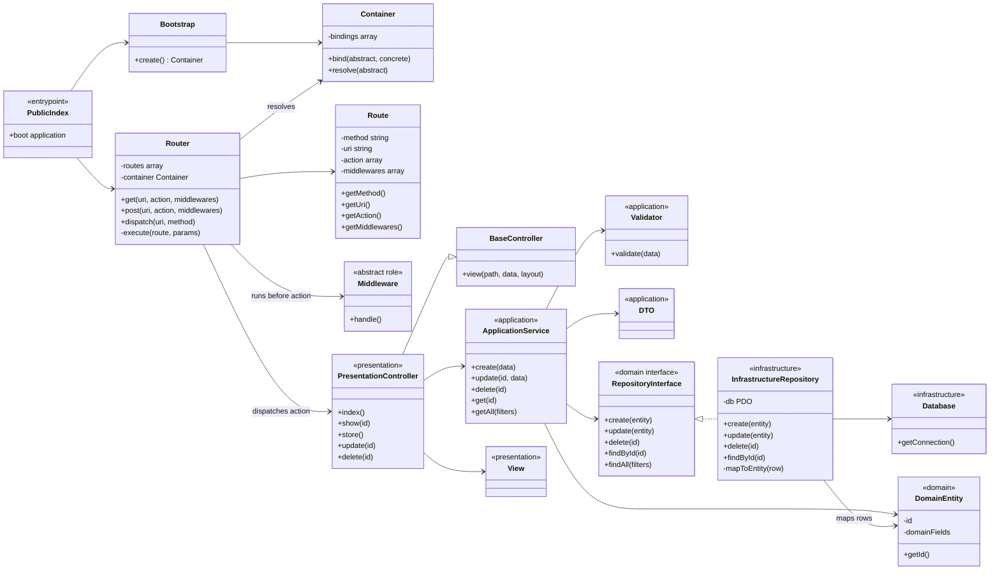

## Main DDD Pattern Per Module

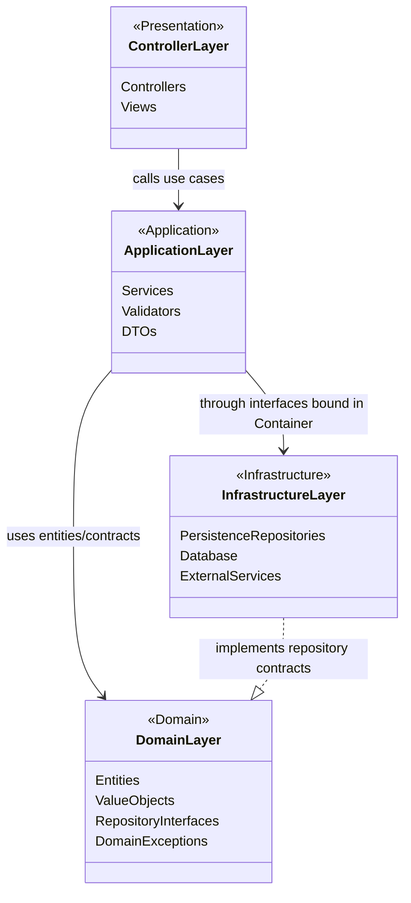

## Club Module

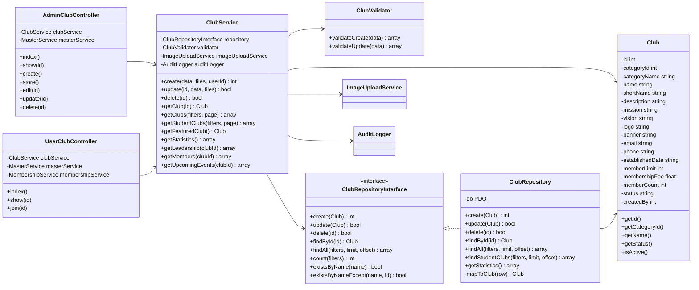

## Auth Module

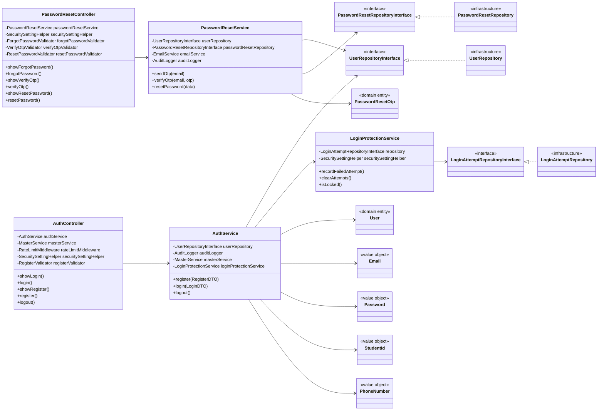

## Event, Attendance, Feedback, And Certificate Flow

```mermaid
classDiagram
    direction LR

    class EventController {
        -EventService eventService
        -ClubService clubService
        -MasterService masterService
        -UserService userService
        -EventAttendanceService eventAttendanceService
        -EventCertificateService eventCertificateService
        +index()
        +show(id)
        +register(id)
        +cancelRegistration(id)
    }

    class AdminEventController {
        -EventService eventService
        -ClubService clubService
        -MasterService masterService
        -EventAttendanceService eventAttendanceService
        +index()
        +create()
        +store()
        +edit(id)
        +update(id)
        +delete(id)
        +registrations(id)
    }

    class EventService {
        -EventRepositoryInterface repository
        -ImageUploadService imageUploadService
        -NotificationService notificationService
        -AuditLogger auditLogger
        +create(data, files)
        +update(id, data, files)
        +delete(id)
        +getEvent(id)
        +getEvents(filters, page)
        +register(eventId, userId)
        +cancelRegistration(eventId, userId)
    }

    class EventAttendanceService {
        -EventAttendanceRepositoryInterface repository
        -EventService eventService
        +getEventAttendance(eventId)
        +store(eventId, data)
        +update(eventId, data)
        +history(userId)
    }

    class EventFeedbackService {
        -EventFeedbackRepositoryInterface repository
        -EventRepositoryInterface eventRepository
        +create(eventId, userId, data)
        +getByEvent(eventId)
        +delete(id)
    }

    class EventCertificateService {
        -EventCertificateRepositoryInterface repository
        -EventService eventService
        -EventAttendanceService attendanceService
        -UserService userService
        +generate(eventId, userId)
        +generateAll(eventId)
        +download(id)
    }

    class EventRepositoryInterface {
        <<interface>>
    }

    class EventAttendanceRepositoryInterface {
        <<interface>>
    }

    class EventFeedbackRepositoryInterface {
        <<interface>>
    }

    class EventCertificateRepositoryInterface {
        <<interface>>
    }

    class EventRepository {
        <<infrastructure>>
    }

    class EventAttendanceRepository {
        <<infrastructure>>
    }

    class EventFeedbackRepository {
        <<infrastructure>>
    }

    class EventCertificateRepository {
        <<infrastructure>>
    }

    class Event {
        <<domain entity>>
    }

    class EventAttendance {
        <<domain entity>>
    }

    class EventFeedback {
        <<domain entity>>
    }

    class EventCertificate {
        <<domain entity>>
    }

    EventController --> EventService
    EventController --> EventAttendanceService
    EventController --> EventCertificateService
    AdminEventController --> EventService
    AdminEventController --> EventAttendanceService
    EventService --> EventRepositoryInterface
    EventAttendanceService --> EventAttendanceRepositoryInterface
    EventAttendanceService --> EventService
    EventFeedbackService --> EventFeedbackRepositoryInterface
    EventFeedbackService --> EventRepositoryInterface
    EventCertificateService --> EventCertificateRepositoryInterface
    EventCertificateService --> EventService
    EventCertificateService --> EventAttendanceService
    EventRepositoryInterface <|.. EventRepository
    EventAttendanceRepositoryInterface <|.. EventAttendanceRepository
    EventFeedbackRepositoryInterface <|.. EventFeedbackRepository
    EventCertificateRepositoryInterface <|.. EventCertificateRepository
    EventService --> Event
    EventAttendanceService --> EventAttendance
    EventFeedbackService --> EventFeedback
    EventCertificateService --> EventCertificate
```

## Membership And Payment Flow

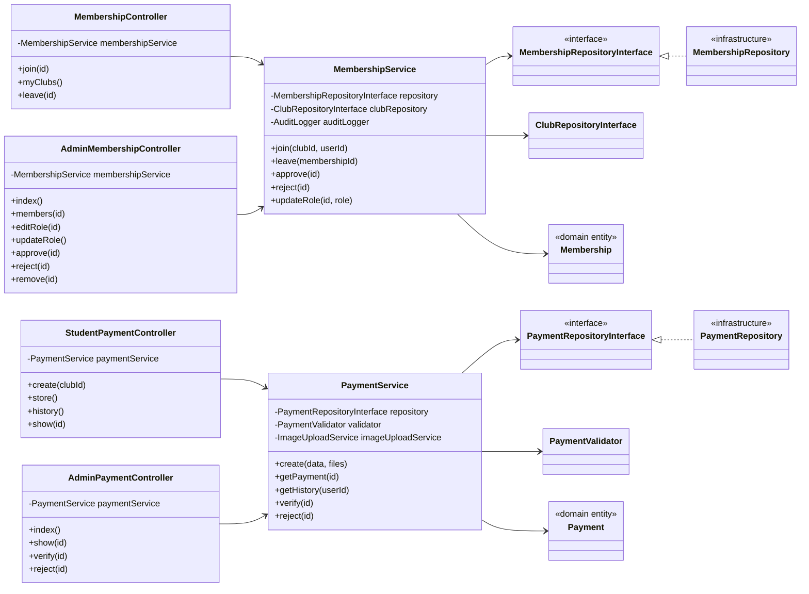

## Admin And Settings Flow

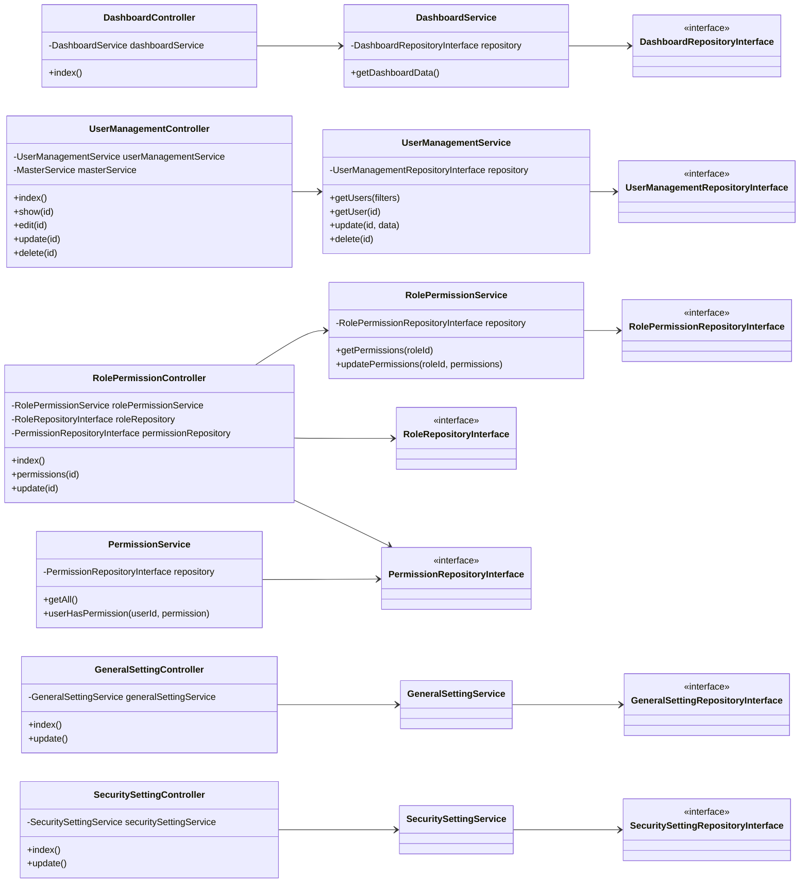

## Other Feature Modules

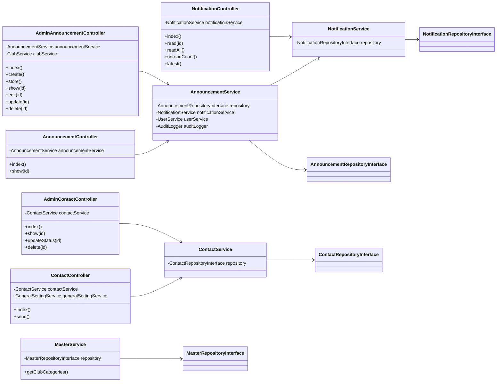

## Simplified Class Diagram For Report

Use this smaller version if your report needs one clean page.

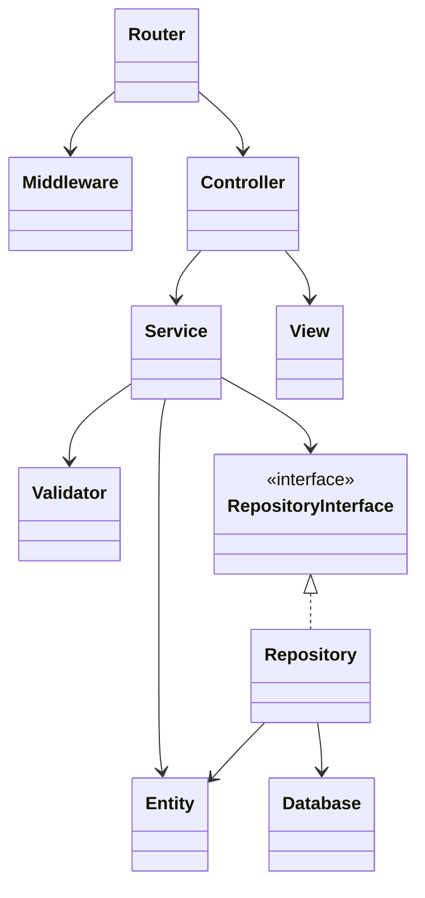
